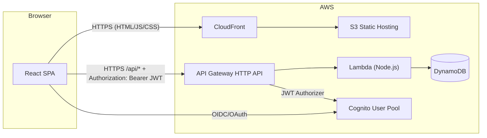

## システム構成

### コンポーネント

- **フロントエンド**
  - Vite + React + TypeScript による SPA
  - S3 バケットに静的ホスティング
  - CloudFront を介して配信（HTTPS / キャッシュ / ドメイン）

- **バックエンド**
  - AWS Lambda (Node.js + TypeScript)
    - 1つの Lambda で複数のパスを処理する小さめモノリス構成
  - API Gateway (HTTP API)
    - Lambda プロキシ統合
    - Cognito User Pool による JWT 認証

- **データストア**
  - DynamoDB
    - `Recipes`, `RecipeIngredients`, `Menus` など

- **認証**
  - Amazon Cognito User Pool
    - SPA 用の App Client
    - Hosted UI or SDK によるログインフロー

- **インフラ管理**
  - AWS CDK（TypeScript）

### コンポーネント図

## セクション一覧

| ドキュメント                           | 内容                                       |
| -------------------------------------- | ------------------------------------------ |
| [フロントエンド](frontend)             | React SPA・静的ホスティング設計            |
| [バックエンド](backend)                | Lambda・API Gateway・Cognito・セキュリティ |
| [データモデル](data-model)             | DynamoDB テーブル設計・型定義              |
| [インフラストラクチャ](infrastructure) | CDK・環境変数・デプロイ・監視              |
