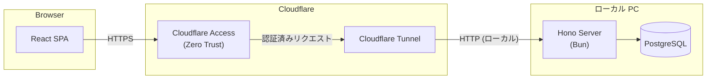

Cooking Planner は、ローカル PC 上で動く Hono server を Cloudflare Tunnel で公開する個人用 Web アプリです。API と静的ファイル配信を1つの Bun + Hono プロセスで担い、データはローカル PostgreSQL に保存します。

## システム構成

- フロントエンド
  - Vite + React + TypeScript による SPA
  - build 済み静的ファイルを Hono server が配信
- バックエンド
  - Bun + Hono
  - API と静的ファイル配信を担う小規模モノリス構成
- データストア
  - PostgreSQL
  - `recipes`, `recipe_ingredients`, `menus` などを保持
- ネットワーク公開
  - Cloudflare Tunnel
  - ローカル PC の Hono server をインターネットに公開
  - HTTPS 終端は Cloudflare 側で処理
- 認証
  - Cloudflare Access
  - 未認証リクエストは Hono server に到達しない

## 技術選定の理由

### SPA + Hono 静的ファイル配信

- 想定ユーザーは自分1人、または少人数であり SEO が不要なため、SSR や SSG の必要性が低い。
- API server と静的ファイル配信を同一プロセスで行うことで、デプロイ手順をシンプルにする。
- 本番相当では API とフロントエンドが同一オリジンになるため、CORS 設定を最小化できる。
- React SPA にすることで UI ロジックをブラウザ側に集約できる。

### Bun + Hono + ローカル PC

- 常時稼働のクラウドサーバーを持たないため、クラウド費用がかからない。
- Bun ランタイムにより高速な起動・実行が可能。
- Hono は軽量で、ローカル PC のリソース消費が少ない。
- Lambda のコールドスタートやフルマネージド DB の制約を受けず、開発・デバッグが容易。

### PostgreSQL

- レシピ・材料・献立はリレーショナルなデータ構造であり、PostgreSQL に適している。
- SQL によるクエリが直感的で、買い物リスト生成のような集計に向いている。
- ローカル PC で動かすため、マネージドサービス固有の制約を受けない。
- ACID トランザクションを標準で利用できる。

### Cloudflare Access / Tunnel

- 一般公開サービスではなく、自分専用アプリとしてアクセス制御したい。
- Cloudflare Access により、認証ポリシーを Cloudflare dashboard で管理できる。
- メール OTP や Google SSO などの認証方法をコードなしで設定できる。
- Cloudflare Tunnel により、ルーターのポート開放や固定 IP なしでローカル server を公開できる。
- HTTPS 証明書管理は Cloudflare 側に任せる。

## 環境構成

- ローカル PC 上で Hono server と PostgreSQL を起動し、Cloudflare Tunnel で公開する構成のみを想定する。
- クラウド環境に dev / prod のような分離は設けない。
- 個人開発のため、本番相当環境はローカル PC とする。

## セクション一覧

| ドキュメント                           | 内容                                             |
| -------------------------------------- | ------------------------------------------------ |
| [フロントエンド](frontend)             | React SPA と静的ファイル配信                     |
| [バックエンド](backend)                | Hono routing・認証・PostgreSQL・トランザクション |
| [データモデル](data-model)             | PostgreSQL テーブル設計・型定義                  |
| [インフラストラクチャ](infrastructure) | ローカル起動・Cloudflare 設定・運用              |
