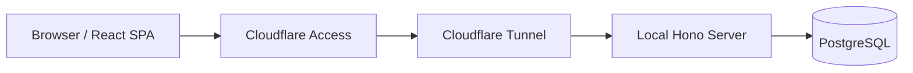

## システム構成

Cooking Planner は、ローカル PC 上で動く Hono server を Cloudflare Tunnel で公開する個人用 Web アプリです。

- フロントエンド: Vite + React + TypeScript
- バックエンド: Bun + Hono
- データベース: PostgreSQL
- 認証: Cloudflare Access
- 公開: Cloudflare Tunnel

## コンポーネント

### フロントエンド

- Vite + React + TypeScript による SPA
- 開発時は Vite dev server で起動
- 本番相当では build 済みファイルを Hono server が静的配信

### バックエンド

- Bun ランタイム上の Hono server
- API ルーティングと静的ファイル配信を同一プロセスで担当
- ローカル PC 上で起動し、Cloudflare Tunnel から転送されるリクエストを受ける

### データストア

- PostgreSQL
- `recipes`, `recipe_ingredients`, `menus` などのテーブルで管理
- 買い物リストはテーブルに保存せず、サーバー側で集計して返す

### 認証と公開

- Cloudflare Access で許可ユーザーを制限
- Cloudflare Tunnel で Hono server の port を外部公開
- Hono server は原則 `127.0.0.1` にバインドする

## セクション一覧

| ドキュメント                           | 内容                                |
| -------------------------------------- | ----------------------------------- |
| [フロントエンド](frontend)             | React SPA と静的ファイル配信        |
| [バックエンド](backend)                | Hono routing・認証・環境変数        |
| [データモデル](data-model)             | PostgreSQL テーブル設計・型定義     |
| [インフラストラクチャ](infrastructure) | ローカル起動・Cloudflare 設定・運用 |
