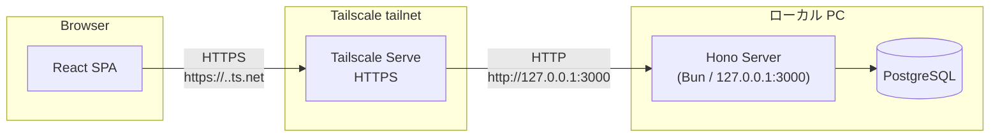

Cooking Planner は、ローカル PC 上で動く Hono server を Tailscale Serve で tailnet 内に限定公開する個人用 Web アプリです。API と静的ファイル配信を1つの Bun + Hono プロセスで担い、データはローカル PostgreSQL に保存します。

## システム構成

- フロントエンド
  - Vite + React + TypeScript による SPA
  - build 済み静的ファイルを Hono server が配信
- バックエンド
  - Bun + Hono
  - API と静的ファイル配信を担う小規模モノリス構成
- データストア
  - PostgreSQL
  - `recipes`, `recipe_ingredients`, `menus` などを保持
- ネットワーク公開
  - Tailscale Serve
  - tailnet に参加している PC / スマホ / タブレットだけからアクセス
  - HTTPS 終端と tailnet 内 DNS は Tailscale 側で処理
- 認証
  - Tailscale tailnet をアクセス境界にする
  - 当面は `DEV_USER_ID=local-dev-user` による単一ユーザー運用を許容する

## 技術選定の理由

### SPA + Hono 静的ファイル配信

- 想定ユーザーは自分1人、または少人数であり SEO が不要なため、SSR や SSG の必要性が低い。
- API server と静的ファイル配信を同一プロセスで行うことで、デプロイ手順をシンプルにする。
- 本番相当では API とフロントエンドが同一オリジンになるため、CORS 設定を最小化できる。
- React SPA にすることで UI ロジックをブラウザ側に集約できる。

### Bun + Hono + ローカル PC

- 常時稼働のクラウドサーバーを持たないため、クラウド費用がかからない。
- Bun ランタイムにより高速な起動・実行が可能。
- Hono は軽量で、ローカル PC のリソース消費が少ない。
- Lambda のコールドスタートやフルマネージド DB の制約を受けず、開発・デバッグが容易。

### PostgreSQL

- レシピ・材料・献立はリレーショナルなデータ構造であり、PostgreSQL に適している。
- SQL によるクエリが直感的で、買い物リスト生成のような集計に向いている。
- ローカル PC で動かすため、マネージドサービス固有の制約を受けない。
- ACID トランザクションを標準で利用できる。

### Tailscale Serve

- 一般公開サービスではなく、自分専用アプリとしてアクセス制御したい。
- 既に Tailscale を導入済みの PC / スマホ / タブレットだけから使えればよい。
- Tailscale Serve により、Hono server を `127.0.0.1` bind のまま tailnet 内 HTTPS として公開できる。
- 独自ドメイン、ルーターのポート開放、インターネット一般公開を当面不要にできる。
- tailnet 外からは URL を知っていても到達できないため、アプリ側のログイン画面を追加せずに運用を始められる。

### Cloudflare Access / Tunnel（代替案）

- 独自ドメインでインターネット公開したい場合は、Cloudflare Tunnel + Cloudflare Access を代替案として使える。
- その場合も Hono server は `127.0.0.1` に bind し、Tunnel から loopback へ転送する。
- Cloudflare Access の JWT 検証に必要な環境変数を設定し、`DEV_USER_ID` を外す。

## 環境構成

- ローカル PC 上で Hono server と PostgreSQL を起動し、Tailscale Serve で tailnet 内に公開する構成を第一候補とする。
- クラウド環境に dev / prod のような分離は設けない。
- 個人開発のため、本番相当環境はローカル PC とする。

## セクション一覧

| ドキュメント                           | 内容                                             |
| -------------------------------------- | ------------------------------------------------ |
| [フロントエンド](frontend)             | React SPA と静的ファイル配信                     |
| [バックエンド](backend)                | Hono routing・認証・PostgreSQL・トランザクション |
| [データモデル](data-model)             | PostgreSQL テーブル設計・型定義                  |
| [インフラストラクチャ](infrastructure) | ローカル起動・Tailscale Serve・運用              |
