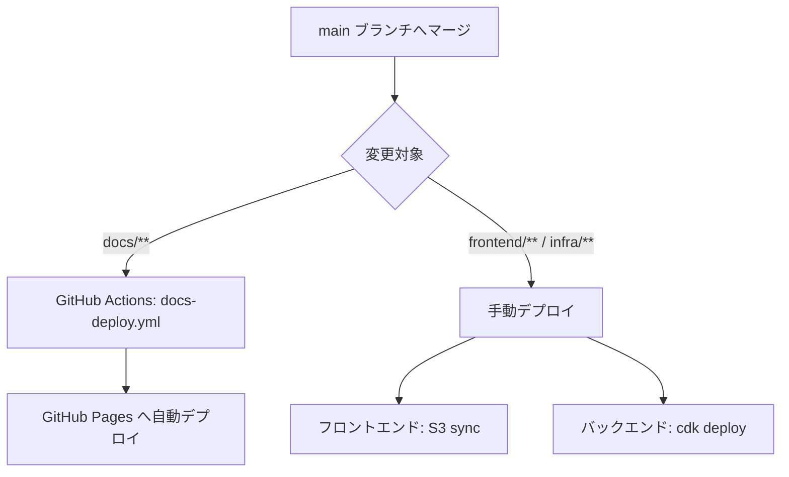

## 環境構成

| 環境 | 用途 | 状態 |
|---|---|---|
| `prod` | 本番環境（自分が実際に使う） | 運用対象 |
| `staging` | 本番前確認用（TODO: 必要になれば追加） | 未構築 |

個人利用アプリのため、当初は `prod` 環境のみで運用する。
将来的に大きな変更を本番前に確認したい場合は `staging` 環境を追加する。

CDK スタックでは `stage` パラメータ（`prod` / `staging`）を受け取れる設計にしておき、必要になった際にスムーズに追加できるようにする。

---

## デプロイ対象コンポーネント

| コンポーネント | デプロイ方法 | 詳細 |
|---|---|---|
| フロントエンド（React SPA） | S3 + CloudFront | [フロントエンドデプロイ](./frontend.md) |
| バックエンド（Lambda + API Gateway） | AWS CDK | [バックエンドデプロイ](./backend.md) |
| インフラ（DynamoDB, Cognito 等） | AWS CDK | [バックエンドデプロイ](./backend.md) |
| ドキュメントサイト | GitHub Actions → GitHub Pages | 自動デプロイ（`docs/**` 変更時） |

---

## デプロイフロー概要



> **TODO**: frontend・インフラ変更の自動デプロイ（GitHub Actions）は将来的に追加予定。

---

## 前提条件

- AWS CLI がインストールされ、`prod` 環境の認証情報（プロファイルまたは環境変数）が設定されていること
- AWS CDK CLI（`cdk`）がグローバルにインストールされていること
- Node.js / npm が利用可能であること

```bash
# バージョン確認
aws --version
cdk --version
node --version
```

---

## デプロイ前チェックリスト

- [ ] `main` ブランチの最新を取得している
- [ ] CI（GitHub Actions）がすべてグリーンになっている
- [ ] ローカルで `npm run build:all` が通ることを確認している
- [ ] `cdk diff` で意図しない変更が含まれていないことを確認している
