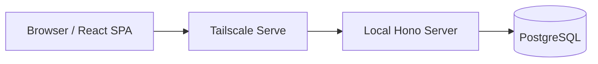

個人利用の料理レシピ／献立／買い物リスト管理アプリケーションの仕様書・設計ドキュメントです。

## ドキュメント構成

| カテゴリ                                             | 内容                                   |
| ---------------------------------------------------- | -------------------------------------- |
| [本番セットアップ](getting-started/production-setup) | 本番相当環境の初回セットアップ手順     |
| [ローカル開発](getting-started/local-dev)            | ローカル開発環境のセットアップ手順     |
| [アーキテクチャ](architecture/overview)              | システム全体構成・技術選定・設計方針   |
| [機能仕様](features/vision-and-scope)                | ビジョン・スコープ・画面仕様・API 設計 |
| [デプロイ](deployment/deployment-overview)           | 起動・公開・運用手順                   |

## アーキテクチャ概要

## 技術スタック

- **フロントエンド**: Vite + React + TypeScript
- **バックエンド**: Bun + Hono
- **データベース**: PostgreSQL
- **認証境界**: Tailscale tailnet
- **公開**: Tailscale Serve
