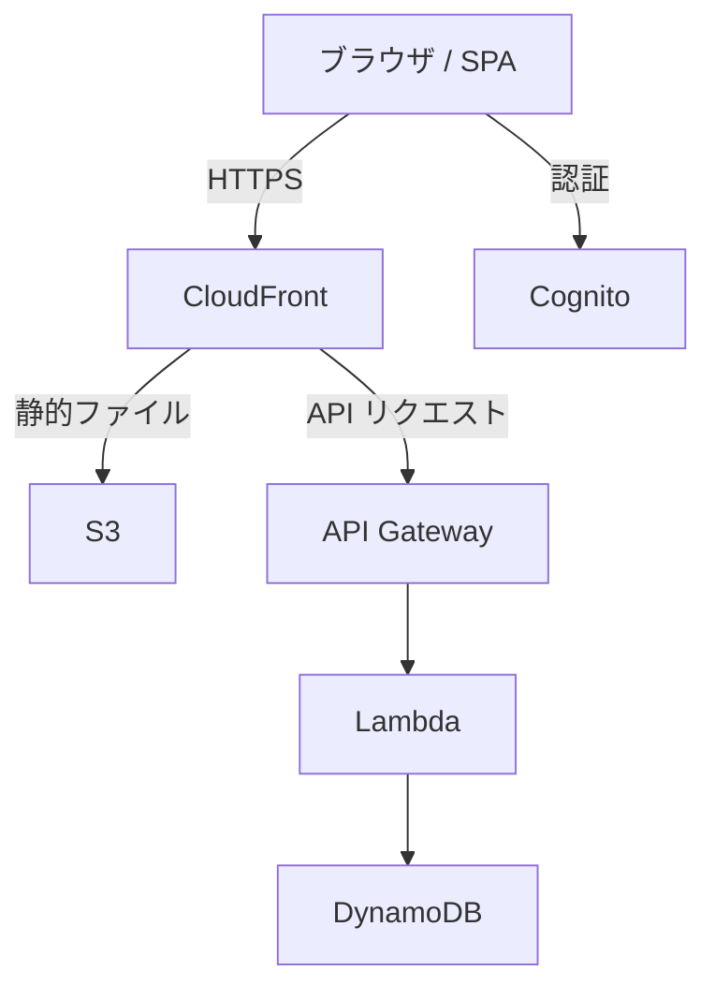

# Cooking Planner ドキュメント

個人利用の料理レシピ／献立／買い物リスト管理アプリケーションの仕様書・設計ドキュメントです。

## ドキュメント構成

| カテゴリ | 内容 |
|---|---|
| [はじめる](getting-started/local-dev) | ローカル開発環境のセットアップ手順 |
| [アーキテクチャ](architecture/overview) | システム全体構成・技術選定・設計方針 |
| [機能仕様](features/vision-and-scope) | ビジョン・スコープ・画面仕様・API 設計 |

## アーキテクチャ概要

## 技術スタック

- **フロントエンド**: React + TypeScript (Vite)
- **バックエンド**: AWS Lambda (Node.js + TypeScript)
- **データベース**: Amazon DynamoDB
- **認証**: Amazon Cognito
- **インフラ**: AWS CDK
