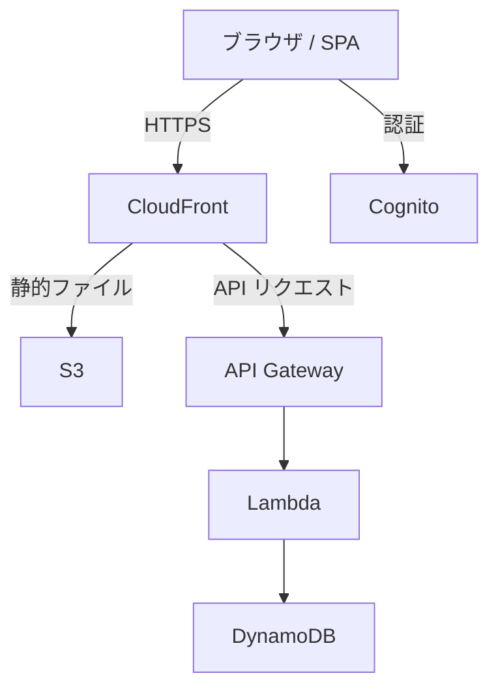

# Cooking Planner ドキュメント

個人利用の料理レシピ／献立／買い物リスト管理アプリケーションの仕様書・設計ドキュメントです。

## ドキュメント構成

| ドキュメント | 内容 |
|---|---|
| ビジョンとスコープ | プロダクトの目的・ゴール・MVP 範囲 |
| 機能と画面 | 画面一覧／画面ごとの振る舞い |
| ドメインモデル | DynamoDB テーブル構造・型定義 |
| API 設計 | HTTP API エンドポイント仕様 |
| アーキテクチャ | 技術選定・インフラ構成 |

## アーキテクチャ概要

## 技術スタック

- **フロントエンド**: React + TypeScript (Vite)
- **バックエンド**: AWS Lambda (Node.js + TypeScript)
- **データベース**: Amazon DynamoDB
- **認証**: Amazon Cognito
- **インフラ**: AWS CDK
