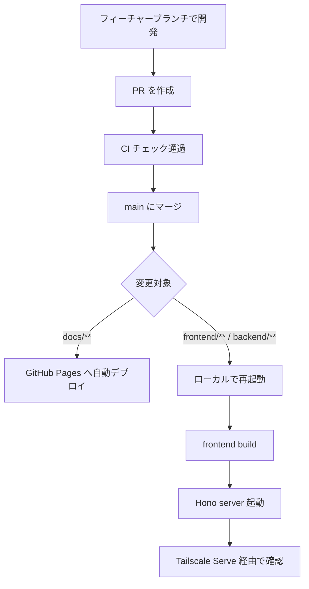

## 概要

個人利用アプリのため、厳密なリリース管理よりもシンプルさを優先します。基本的には `main` ブランチへのマージ後にローカル PC 上で Hono server を再起動します。

## 通常リリースフロー



## 手順

1. フィーチャーブランチで開発し、PR を作成する。
2. CI のチェックがすべて通ることを確認する。
3. `main` ブランチにマージする。
4. ローカル PC で最新の `main` を取得する。
5. 必要に応じて依存関係を更新する。
6. PostgreSQL を起動する。
7. `bun run start` で frontend build 後に Hono server を起動する。
8. ローカル PC で `http://127.0.0.1:3000/` と `/health` を確認する。
9. `tailscale serve --bg 3000` または既存の Serve 設定を確認する。
10. Tailscale Serve 経由で主要画面と API を確認する。

## ホットフィックス

本番で緊急対応が必要な場合も、通常と同じフィーチャーブランチ → PR → マージ → 再起動のフローを踏みます。

```bash
git checkout main
git pull
git checkout -b fix/<Issue番号>-<説明>
```

## リリース後の確認

- [ ] 主要画面（レシピ一覧、献立、買い物リスト）が正常に表示される。
- [ ] `/health` が正常に応答する。
- [ ] 業務 API が正常に応答する。
- [ ] tailnet 内端末から Tailscale Serve 経由でアクセスできる。
- [ ] Hono server のログに想定外のエラーがない。
