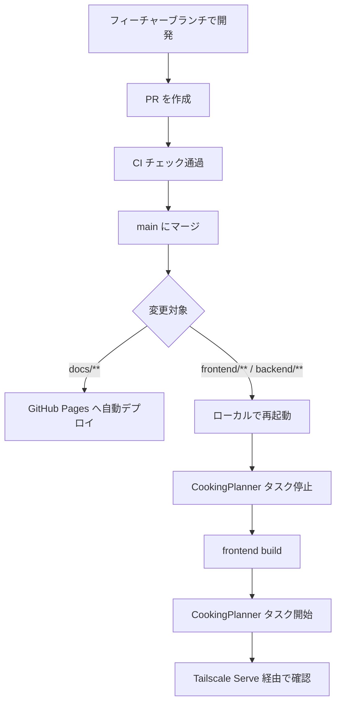

## 概要

個人利用アプリのため、厳密なリリース管理よりもシンプルさを優先します。基本的には `main` ブランチへのマージ後にローカル PC 上の `CookingPlanner` タスクを停止し、frontend build 後に再開します。

## 通常リリースフロー



## 手順

1. フィーチャーブランチで開発し、PR を作成する。
2. CI のチェックがすべて通ることを確認する。
3. `main` ブランチにマージする。
4. `pwsh ./scripts/windows/cooking-planner-task.ps1 Stop` で常駐タスクを停止する。
5. ローカル PC で最新の `main` を取得する。
6. 必要に応じて依存関係を更新する。
7. `bun run frontend:build` で frontend を build する。
8. `pwsh ./scripts/windows/cooking-planner-task.ps1 Start` で常駐タスクを開始する。
9. `Status` でタスク状態を確認する。
10. ローカル PC で `http://127.0.0.1:3000/` と `/health` を確認する。
11. `tailscale serve status` で既存の Serve 設定を確認する。
12. Tailscale Serve 経由で主要画面と API を確認する。

```powershell
pwsh ./scripts/windows/cooking-planner-task.ps1 Stop
git pull
bun install --frozen-lockfile
bun run frontend:build
pwsh ./scripts/windows/cooking-planner-task.ps1 Start
pwsh ./scripts/windows/cooking-planner-task.ps1 Status
Invoke-WebRequest http://127.0.0.1:3000/health
tailscale serve status
```

初回セットアップでタスクが未登録の場合は、[Windows自動起動](./windows-scheduled-task.md)の登録手順を先に実施します。

## ホットフィックス

本番で緊急対応が必要な場合も、通常と同じフィーチャーブランチ → PR → マージ → 再起動のフローを踏みます。

```bash
git checkout main
git pull
git checkout -b fix/<Issue番号>-<説明>
```

## リリース後の確認

- [ ] 主要画面（レシピ一覧、献立、買い物リスト）が正常に表示される。
- [ ] `/health` が正常に応答する。
- [ ] 業務 API が正常に応答する。
- [ ] tailnet 内端末から Tailscale Serve 経由でアクセスできる。
- [ ] Hono server のログに想定外のエラーがない。
- [ ] `CookingPlanner` タスクが `Running` になっている。
