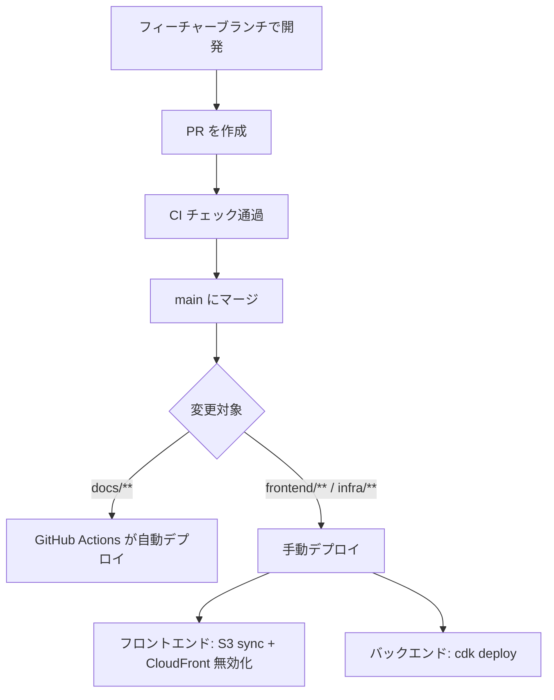

## 概要

個人利用アプリのため、厳密なリリース管理よりもシンプルさを優先する。
基本的には `main` ブランチへのマージ後に手動デプロイを行う。

---

## 通常リリースフロー



### 手順

1. フィーチャーブランチで開発し、PR を作成する
2. CI（GitHub Actions）のチェックがすべてグリーンになることを確認する
3. `main` ブランチにマージする
4. 変更内容に応じてデプロイを実行する
   - フロントエンド変更 → [フロントエンドデプロイ](../deployment/frontend.md) を参照
   - バックエンド・インフラ変更 → [バックエンドデプロイ](../deployment/backend.md) を参照
   - ドキュメントのみ → 自動デプロイのため手作業不要

---

## staging 環境でのリリース前確認

> **TODO**: staging 環境が必要になった場合、以下の手順を追加する。
> - `main` マージ後に staging へデプロイ
> - 動作確認後に prod へデプロイ

現時点では prod 環境のみ運用のため、staging 確認は省略する。
破壊的変更や大きな機能追加の場合は、ローカル環境での動作確認を十分に行ってから prod にデプロイする。

---

## ホットフィックス

本番で緊急対応が必要な場合も、通常と同じフィーチャーブランチ → PR → マージ → デプロイのフローを踏む。

```bash
# ホットフィックス用ブランチを main から作成
git checkout main
git pull
git checkout -b hotfix/<説明>

# 修正後に PR を作成して main にマージ
```

---

## デプロイ後の確認

デプロイ後は以下を確認する。

- [ ] 主要画面（レシピ一覧、献立など）が正常に表示されるか
- [ ] API レスポンスが正常か（CloudWatch Logs でエラーがないか確認）
- [ ] 認証フローが正常に動作するか
